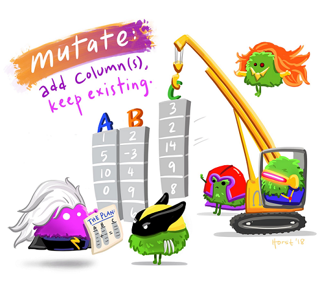
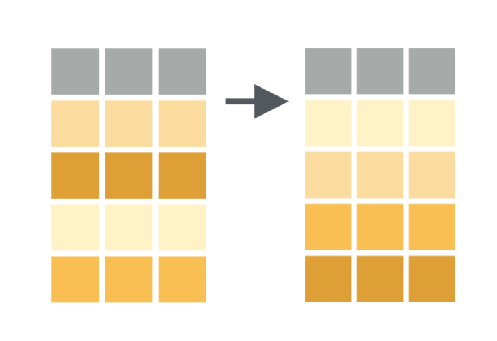
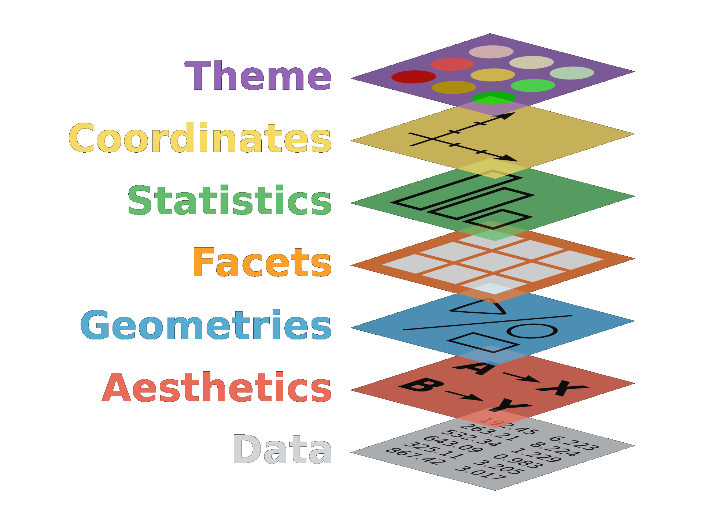
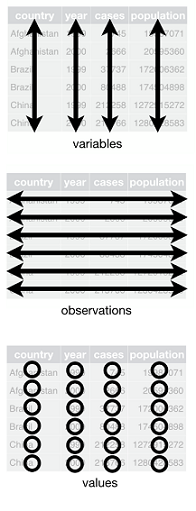

```{r setup, include=FALSE}
knitr::opts_chunk$set(htmltools.dir.version = FALSE, fig.retina = 3, eval = FALSE)
library(knitr)
library(kableExtra)
```

```{r xaringan-themer, include=FALSE, warning=FALSE}
library(xaringanthemer)
style_mono_accent(
 base_color = "#36454f",
 black_color = "#0F425CFF",
 header_color = "#08344b",
 text_bold_color = "#c85200",
 link_color = "#009E73",
 table_row_even_background_color = "#FFFFFF",
 title_slide_text_color = "#dddaa0",
 table_border_color = "#01665E",
 code_highlight_color = "#afcee5",
 header_font_google = google_font("Fira Sans"),
 text_font_google   = google_font("Lato", "400", "400i"))
```

class: center


---
background-image: url(./images/tidyverse.png)
background-position: 95% 5%
background-size: 10%

#The workshop plan

During the session you will learn:

--

- How to use the pipe `%>%` operator

--

- What is the Tidyverse and differences with base R

--

- How to clean and transform your data with `dplyr`

--

- What is tidy data and how to make your raw data tidy &#x2728;

--

- The ggplot grammar &#x1F4C8;&#x1F4CA;

--

We will use this [**shared doc**](https://pad.riseup.net/p/oscr_tidyverse) to communicate (no account needed)
---

# First, what is tidyverse??

--

.center[]

.footnote[
As a set of principles: Human-centered, Consistent, Composable, Inclusive]
---
background-image: url(./images/magrittr.png)
background-position: 95% 5%
background-size: 10%

# The Pipe operator **%>%** _(and then)_

.center[]

---
background-image: url(./images/magrittr.png)
background-position: 95% 5%
background-size: 10%

# The Pipe operator **%>%** _(and then)_

.center[]

.footnote[**Shortcut:** Control/Cmd + shift + m]

---
background-image: url(./images/magrittr.png)
background-position: 95% 5%
background-size: 10%

# The Pipe operator **%>%** _(and then)_


.center[]

.footnote[**Shortcut:** Control/Cmd + shift + m]

---
background-image: url(./images/magrittr.png)
background-position: 95% 5%
background-size: 10%

# The Pipe operator **%>%** _(and then)_

.center[]

.footnote[**Shortcut:** Control/Cmd + shift + m]

---

#R base vs. tidyverse

.left[

####Base R:

**starwars**[**starwars**$height <200&
          **starwars**$gender == "male",]
]

--

<br><br>

.pull-right[

####Tidyverse:

**starwars** %>% 

  filter(height <200, gender == "male")
]

---

# R base vs. tidyverse

.left[

#### Base R:

**starwars**$bmi <- **starwars**$mass/(**starwars**$height/100)^2)

]

--

<br><br>

.pull-right[

#### Tidyverse:

**starwars** %>% 

mutate(bmi = mass/((height/100)^2))

]

---

# Hands on!

Best option: 

- Sign to Rstudio cloud, and join the [**project**](https://bit.ly/2Bvq6ap).

- Make a **permanent copy** by clicking at right top corner. 

Or 

- Download the project folder and work on your Rstudio

### In any case open: **02_R**,  **workshop.Rmd**

- Open the tidyverse library

```{r, eval = TRUE, message = FALSE}
library(tidyverse)
library(here)
```


---

# The dataset

We will use 2 sets of data from the TV series **Game of thrones**:

  1) `got_char.csv`: the total of minutes and seconds in TV per season for each character.

  2) `got_houses.csv`: gender and the house each character represents. 


**#nospoilers**


.footnote[
1) Source: `r icon::fa("github")` [benkahle/bayesianGameofThrones](https://github.com/benkahle/bayesianGameofThrones)

2) Source: `r icon::fa("github")` [Preetish/GoT_screen_time](https://github.com/Preetish/GoT_screen_time)]

---

background-image: url(./images/readr.png)
background-position: 95% 5%
background-size: 10%

# Import files

Consider type of files:

* We use `read_csv` for files delimited by commas

* Use `read_csv2` for files delimited by semicolon 

--

* If you use data in SPSS, Stata, SAS, the best package is [rio](https://cran.r-project.org/web/packages/rio/vignettes/rio.html)
  - It is a Swiss knife that wraps all packages 
  
  - Only one function to import any kind of file: `import()`
  
  - Only one function to export any kind of file: `export()`


---
background-image: url(./images/drake_nohex.jpg)
background-position: 95% 5%
background-size: 10%

# About reproducibility

<br><br><br>

-  **AVOID** absolute paths or setting/clearing directory using **R Projects** 

```{r, eval = FALSE}
got_char <-
  read_csv("C:/Users/palol/Dropbox/github/
           tidyverse_workshop_oscr/01_data/got_char.csv")
```

.footnote[Check [this post](https://www.tidyverse.org/blog/2017/12/workflow-vs-script/) to understand why [Jenny Bryan](https://rstudio.com/speakers/jenny-bryan/) will come and set your computer on &#x1F525; if your first line in your R scripts are
`setwd("C:\Users\paloma\path\that\only\I\have")` or
`rm(list = ls())`]

---
background-image: url(./images/drake_yeshex.jpg)
background-position: 95% 5%
background-size: 10%

# About reproducibility

  - Use relative paths

```{r, eval = FALSE}
got_char <- read_csv("../01_data/got_char.csv")
```

  - Even better, use `readr` + `here` 

```{r, eval = FALSE}
got_char <- read_csv(here("01_data", "got_char.csv"))
```

.footnote[Check [this post](https://malco.io/2018/11/05/why-should-i-use-the-here-package-when-i-m-already-using-projects/) to understand why to use `here` inside projects]

---

# Import with `read_csv`

```{r, message=FALSE, eval = TRUE}

got_char <- read_csv(here("01_data", "got_char.csv"))

got_houses <- read_csv(here("01_data", "got_houses.csv"))

```

---

### Exercise 1. Building the Top 10 within the first 3 seasons

```{r echo=FALSE, eval = TRUE}
got_char %>%
  left_join(got_houses, by = c("actor" = "name")) %>% 
  mutate(total = (season_1 + season_2 + season_3)) %>% 
  arrange(desc(total)) %>% 
  select(actor, total, house_a) %>% 
  slice(1:10) %>% 
  rename(Character = actor,
         House = house_a,
         `Total acting time` = total) %>% 
  kable() %>% 
  kable_styling(bootstrap_options = c("hover", "condensed", "responsive"),
                full_width = F, font_size = 16) %>%  
  row_spec(0, bold = T) %>% 
  add_header_above(c("TOP 10 Characters" = 3))
```

---

background-image: url(./images/dplyr.png)
background-position: 95% 5%
background-size: 10%

## Dplyr package


`Dplyr` is a package that provides a set of tools for efficiently manipulating datasets in R.

Today we will learn the following functions:


.pull-left[

- mutate

- arrange
  
- select
  
- rename]


.pull-right[
  
- slice
  
- left_join (and family of joins) 
  
- group_by
  
- summarise/summarize
  
]

---

## 1. Merge the two tables with `left_join`

.pull-left[

1. Pick identifier/key variables on each datase

  - got_char = **actor**
  
  - got_houses = **name**

2. Choose how you want to merge

]

--

.pull-right[


]

```{r, echo = FALSE, eval = TRUE}
got_complete <- got_char %>% left_join(got_houses, by = c("actor" = "name"))
```

.footnote[[Animated joins by @gadenbuie](https://github.com/gadenbuie/tidyexplain)]

---

## 2. Make new columns with `mutate`

```{r}
got_complete %>%
  mutate(total = season_1 + season_2 + season_3)
```

.pull-left[

]

.pull-right[

- Make new variables
  
  a) With a specific value
  
  b) Based on other variables
  
  c) Change an existing variable

]

.footnote[Art by [Allison Horst](https://github.com/allisonhorst)]

---

## 3. Reorganize your rows with `arrange` 

.pull-left[
Ascending
```{r, eval = FALSE}
got_complete %>% 
  arrange(total)
```


Descending

```{r}
got_complete %>% 
  arrange(desc(total))
```

]

.pull-right[


]

---

## 4. Select/remove columns with `select`

```{r}
got_complete %>%
  select(actor, total, house_a) 
```

--

Helpful feats of `select`

a) starts_with("season")

b) contains("hous")

c) matches("_[:digit:]")

d) -actor

e) -c(actor, total)

f) everything()


---

## 5. **`rename`** variables

new name = old name

```{r}
got_complete %>% 
  rename(Character = actor,
         House = house_a,
         `Total acting time` = total)
```

## 6. **`slice`** rows

```{r}
got_complete %>% 
  slice(1:10)
```

---

## Pipe all steps and...ta da!

```{r, eval = FALSE}
got_char %>%
  left_join(got_houses, by = c("actor" = "name")) %>% 
  mutate(total = (season_1 + season_2 + season_3)) %>% 
  arrange(desc(total)) %>% 
  select(actor, total, house_a) %>% 
  slice(1:10) %>% 
  rename(Character = actor,
         House = house_a,
         `Total acting time` = total)
```

---

<br><br><br>

```{r, echo = FALSE}
got_char %>%
  left_join(got_houses, by = c("actor" = "name")) %>% 
  mutate(total = (season_1 + season_2 + season_3)) %>% 
  arrange(desc(total)) %>% 
  select(actor, total, house_a) %>% 
  slice(1:10) %>% 
  rename(Character = actor,
         House = house_a,
         `Total acting time` = total)
```

---

### Exercise 2. How is the gender distribution across houses?

```{r echo = FALSE, fig.width = 12,eval = TRUE}
got_houses %>%
  drop_na(gender, house_a) %>% 
  group_by(house_a) %>% 
  mutate(n = n()) %>% 
  ungroup() %>% 
  filter(n >5) %>%
  mutate(gender = ifelse(gender == 0, "Female", "Male")) %>%
  ggplot(aes(y = reorder(house_a,n), fill= gender)) +
  geom_bar() +
  labs(title = "Distribution of gender across the houses",
       x = "Number of characters",
       y = "House",
       fill = "Gender") +
  theme_minimal()
```

---

## 1. Explore the variables with `count`

.pull-left[
```{r}
got_houses %>% 
  count(gender)
```
]

--

.pull-right[
```{r}
got_houses %>% 
  count(house_a, sort = TRUE) %>% 
  slice(1:4)

```
]

---

## 2. Drop missing observations (rows) with `drop_na`

```{r}
got_houses %>%
  drop_na(gender, house_a)
```


---

## 3. Do operations within categories of a variable with `group_by`

.pull-left[
```{r}
got_houses %>% 
  group_by(house_a) %>% 
  mutate(n = n()) %>% 
  ungroup()
```

**n()** gives the current group size.
]

.pull-right[

]

---

## 4. `Filter` rows with a criteria


.footnote[Art by [Allison Horst](https://github.com/allisonhorst)]

---

## 4. Filter

How would you filter houses that have at least 10 characters?

a) `got_houses %>% filter(n >= 10)`

b) `got_houses %>% filter(n < 10)`

c) `got_houses %>% filter(houses_a >= 10)`

---

## 5. Make labels for gender

### Using `ifelse`, only 2 conditions

ifelse(`condition`, **TRUE**, FALSE)

```{r}
got_houses %>%
  mutate(gender = ifelse(gender == 0, "Female", "Male"))
```


Tip: Use **`case_when`** for more than two conditions


---

## Data ready to be plotted!

```{r, eval = TRUE}
got_houses_plot <- got_houses %>%
  drop_na(gender, house_a) %>%
  group_by(house_a) %>%
  mutate(n = n()) %>%
  ungroup() %>%
  filter(n > 10) %>%
  mutate(gender = ifelse(gender == 0, "Female", "Male"))
```

--

```{r, eval = TRUE}
got_houses_plot %>% 
  head(4)
```


---

## `ggplot` grammar


.pull-left[

**Data** = tibble 

**Aesthetics** = variables to be plotted

**Geometries** = Type of plot

**Theme** = colors and details

We go from **`%>%`** for a **`+`** for each layer
]

.pull-right[

]

.footnote[[Adapted picture from @CedScherer](https://twitter.com/CedScherer/status/1229392907234402305/photo/2)]

---

## 1. Let's start with a basic bar plot

.pull-left[
```{r, eval = FALSE}
got_houses_plot %>%
  ggplot(aes(house_a)) +
  geom_bar()
```
  ]

.pull-right[
```{r, echo=FALSE, eval = TRUE}
got_houses_plot %>%
  ggplot(aes(house_a)) +
  geom_bar()
```
]

---
## 2. Now let's add add gender to aes()

.pull-left[
```{r eval = FALSE}
got_houses_plot %>%
  ggplot(aes(house_a, 
             fill = gender)) + #<<
  geom_bar()
```
  ]

.pull-right[
```{r echo = FALSE, eval = TRUE}
got_houses_plot %>%
  ggplot(aes(house_a, 
             fill = gender)) + #<<
  geom_bar()
```
]

---

## 3. Flip the coords

.pull-left[
```{r eval = FALSE}
got_houses_plot %>%
  ggplot(aes(y = house_a, #<<
             fill= gender)) +
  geom_bar()
```
]

.pull-right[
```{r echo = FALSE, eval = TRUE}
got_houses_plot %>%
  ggplot(aes(y = house_a, 
             fill= gender)) +
  geom_bar()
```
]

Before `ggplot2 3.3.0` (last version) we needed to use `coord_flip()`

---

## 4. Sort by frequency

.pull-left[
```{r eval = FALSE}
got_houses_plot %>%
  ggplot(aes(y = reorder(house_a, n), #<<
             fill= gender)) +
  geom_bar()
```
  ]

.pull-right[
```{r echo = FALSE, eval = TRUE}
got_houses_plot %>%
  ggplot(aes(y = reorder(house_a, n), fill= gender)) +
  geom_bar()
```
]

---
## 5. Details count &#x1F485;&#x1F3FD;


```{r eval = FALSE}
got_houses_plot %>%
  ggplot(aes(y = reorder(house_a, n), 
             fill= gender)) +
  geom_bar() +
  labs(title = "Distribution of gender across the houses",
       x = "Number of characters",
       y = "House",
       fill = "Gender") +
  theme_minimal()
```

---

<br><br><br>

.center[
```{r echo = FALSE, eval = TRUE,  fig.width = 12}
got_houses_plot %>%
  ggplot(aes(y = reorder(house_a, n), fill= gender)) +
  geom_bar() +
  labs(title = "Distribution of gender across the houses",
       x = "Number of characters",
       y = "House",
       fill = "Gender") +
  theme_minimal()
```
]

---

## Exercise 3. How was the evolution of the protagonists across seasons?

```{r echo = FALSE, fig.width= 14, eval = TRUE}
got_complete %>%
  pivot_longer(
    cols = season_1:season_7,
    names_to = "season",
    values_to = "time",
    names_prefix = "season_") %>% 
  group_by(actor) %>%
  mutate (total = sum(time)) %>%
  ungroup () %>%
  filter(total >130) %>%
  ggplot(aes(season, time, group = actor, color = actor)) +
  geom_point() +
  geom_line() +
  theme_minimal() +
  labs(title = "Evolution of the protagonists across seasons",
       x = "Season",
       y = "Total time (min)",
       color = "Protagonist") +
  theme_minimal()
```

**What variables do we need to plot this graph?**

---

## What is tidy data


.pull-left[

- **Rule 1**: Each **_variable_** must have its own **_column_**.
<br><br><br><br><br><br>
- **Rule 2**: Each **_observation_** must have its own **_row_**.
<br><br><br><br><br><br>
- **Rule 3**: Each **_value_** must have its own **_cell_**.
]

.pull-right[

<center>

<center>
]
.foot-note[https://r4ds.had.co.nz/]

---

### Go from wide to long with `pivot_longer`


---

### Go from wide to long with `pivot_longer`

```{r}
got_complete %>%
  pivot_longer(
    cols = season_1:season_7,
    names_to = "season",
    values_to = "time",
    names_prefix = "season_")

head(got_long)

```

---

### Go from wide to long with `pivot_longer`

```{r}
got_complete %>%
  pivot_longer(
    cols = season_1:season_7, #<<
    names_to = "season",
    values_to = "time",
    names_prefix = "season_")
```


---

### Go from wide to long with `pivot_longer`

```{r}
got_complete %>%
  pivot_longer(
    cols = season_1:season_7,
    names_to = "season", #<<
    values_to = "time",
    names_prefix = "season_")
```


---

### Go from wide to long with `pivot_longer`

```{r}
got_complete %>%
  pivot_longer(
    cols = season_1:season_7,
    names_to = "season",
    values_to = "time", #<<
    names_prefix = "season_")
```


---


### Go from wide to long with `pivot_longer`

```{r, eval= TRUE}
got_long <- got_complete %>%
  pivot_longer(
    cols = season_1:season_7,
    names_to = "season",
    values_to = "time", 
    names_prefix = "season_") #<<
```

```{r, echo = FALSE}
got_long %>% 
  head(4)
```

---

### Create a total sum of time by character

.pull-left[

**`group_by() + summarise()`**

```{r, message = FALSE}
got_long %>%
  group_by(actor) %>%
  summarise (total = sum(time)) %>%
  ungroup ()
```


]

--

.pull-left[
**`group_by() + mutate()`**

```{r}
got_long %>%
  group_by(actor) %>%
  mutate(total = sum(time)) %>%
  ungroup()
```


]

```{r, echo = FALSE, eval = TRUE}
got_long <- got_long %>%
  group_by(actor) %>%
  mutate(total = sum(time)) %>%
  ungroup ()
```


---

### Back to the graph

```{r echo = FALSE, fig.width= 12, eval = TRUE}
got_long %>%
  filter(total > 130) %>%
  ggplot(aes(season, time, group = actor, color = actor)) +
  geom_point() +
  geom_line() +
  theme_minimal() +
  labs(title = "Evolution of the protagonists across seasons",
       x = "Season",
       y = "Total time (min)",
       color = "Protagonist") +
  theme_minimal()
```

---

### 1. Add the aesthetics and geoms

.pull-left[
```{r eval = FALSE}
got_long %>%
  ggplot(aes(season, time))+
  geom_point() +
  geom_line()
```
  ]

.pull-right[
```{r echo = FALSE, eval = TRUE}
got_long %>%
  ggplot(aes(season, time))+
  geom_point() +
  geom_line()
```
]

---

### 2. Add actors to aes()

.pull-left[
```{r eval = FALSE}
got_long %>%
  ggplot(aes(season, time, 
             group = actor)) + #<<
  geom_point() +
  geom_line()
```
  ]

.pull-right[
```{r echo = FALSE, eval = TRUE}
got_long %>%
  ggplot(aes(season, time, 
             group = actor))+
  geom_point() +
  geom_line()
```
]

---

### 3. Filter the top ten (>130min)

.pull-left[
```{r eval = FALSE}
got_long %>%
  filter(total >130) %>%
  ggplot(aes(season, time, 
             group = actor))+
  geom_point() +
  geom_line()
```
  ]

.pull-right[
```{r echo = FALSE, eval = TRUE}
got_long %>%
  filter(total >130) %>%
  ggplot(aes(season, time, group = actor))+
  geom_point() +
  geom_line()
```
]

---

### 4. Add a color for each character

.pull-left[
```{r eval = FALSE}
got_long %>%
  filter(total >130) %>%
  ggplot(aes(season, time, 
             group = actor, 
             color = actor)) + #<<
  geom_point() +
  geom_line()
```
  ]

.pull-right[
```{r echo = FALSE, eval = TRUE}
got_long %>%
  filter(total >130) %>%
  ggplot(aes(season, time, group = actor, color = actor))+
  geom_point(show.legend = FALSE) +
  geom_line(show.legend = FALSE)
```
]

---
### 5. Details

```{r eval = FALSE}
got_long %>%
  filter(total >130) %>%
  ggplot(aes(season, time, group = actor, color = actor)) +
  geom_point() +
  geom_line() +
  theme_minimal() +
  labs(title = "Evolution of the protagonists across seasons",
       x = "Season",
       y = "Total time (min)",
       color = "Protagonist") +
  theme_minimal()
```


---

### Final graph

```{r echo = FALSE, fig.width= 12, eval = TRUE}
got_long %>%
  filter(total >130) %>%
  ggplot(aes(season, time, group = actor, color = actor)) +
  geom_point() +
  geom_line() +
  theme_minimal() +
  labs(title = "Evolution of the protagonists across seasons",
       x = "Season",
       y = "Total time (min)",
       color = "Protagonist") +
  theme_minimal()

```

---

background-image: url("https://gph.to/2GrDSdk")
background-position: 50% 50%

# We did it!

---
# Useful resources

- Learn tidyverse with the R4DS book (free online): https://r4ds.had.co.nz/

- Practice your skills with the primers: https://rstudio.cloud/learn/primers

- Join the R4DS and Tidy-tuesday community in twitter

---
name: title
class: center, middle
#Thank you!!!#


###Keep in touch!
`r icon:: fa("paper-plane", colour ="#011A5E")`</i>&nbsp;l.rojassaunero@erasmusmc.nl</a><br>

`r icon:: fa("twitter", colour = "#011A5E")` <a href="http://twitter.com/palolili23"> </i>&nbsp; @palolili23</a><br>

`r icon:: fa("github", colour = "#011A5E")` <a href="http://twitter.com/palolili23"> </i>&nbsp; @palolili23</a><br>

